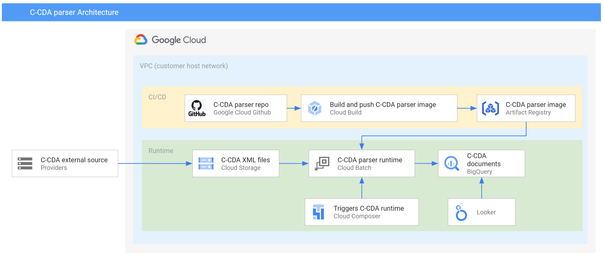
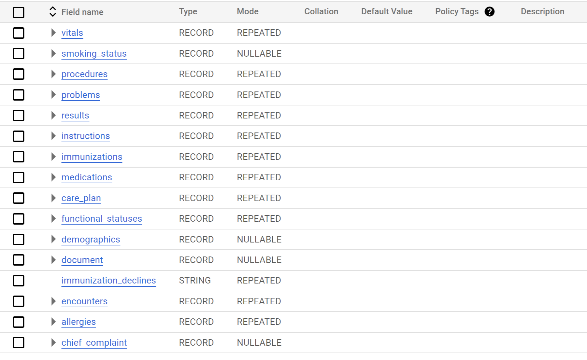

# Overview
This application will allow healthcare providers to parse and load C-CDA "[Consolidated Clinical Document Architecture](https://en.wikipedia.org/wiki/Consolidated_Clinical_Document_Architecture)"  files from XML format to BigQuery so that analytics and models on this data could be leveraged to better serve the patients.

This application uses [BlueButton.js](https://github.com/blue-button/bluebutton.js) module to parse C-CDA files and loads into BigQuery. This application can be used as a batch load of C-CDA files available in (specified) GCS location and loaded into (Specified) BigQuery table.

# Architecture



# Build instructions
### Prerequisite
The following prerequisite are required for the build

1. [Installed Google Cloud SDK](https://cloud.google.com/sdk/docs/install)

The following services needs to be enabled
* [Cloud Build API](https://cloud.google.com/build/docs)
* [Artifact Registry API](https://cloud.google.com/artifact-registry/docs)
* [Batch API](https://cloud.google.com/batch/docs/get-started)

You can check if these services are enabled by running these commands
```sh

export PROJECT_ID=<YOUR_PROJECT_ID>

```

```sh
gcloud services list --enabled --project $PROJECT_ID | grep -E "cloudbuild.googleapis.com|artifactregistry.googleapis.com|batch.googleapis.com"

```
### Clone the repo
1. Clone this repo for building the application image in your environment.

```sh
git clone https://github.com/anandj123/ccda-parser-personal.git && cd ccda-parser

```
### Google Cloud CLI (command line interface) setup
Setup Google Cloud IAM permissions for access to read GCS files and write to BigQuery tables.

Get the authentication token to run this application for your GCP project. 

```sh
gcloud auth application-default login
gcloud config set project <YOUR_PROJECT_NAME>
```

### Setup environment variables for the application

The following environment variables are required for the application.

```sh
export PROJECT_ID=<YOUR_PROJECT_ID>
export GCS_LOCATION=<YOUR_GCS_LOCATION_FOR_CCDA_XML_FILES>
export BQ_LOCATION=<TARGET_BQ_TABLE>
export IMAGE_LOCATION=<YOUR_IMAGE_LOCATION>
export REGION=<YOUR_REGION>
export COMPOSER_ENVIRONMENT=<YOUR_COMPOSER_ENVIRONMENT_NAME>
```
|Variable Name|Description|
|---|---|
|PROJECT_ID|Provide your project id. |
|GCS_LOCATION| Provide GCS location for input CCDA XML files e.g. **gs://bucket_name/folder_name/** |
|BQ_LOCATION| Provide BigQuery table name to store the result e.q. **project-id.data-set-id.table-id** |
|IMAGE_LOCATION|Provide the artifact registry location e.g. **us-docker.pkg.dev/<YOUR_PROJECT_ID>/ccda-bigquery-repo/ccda-bigquery:latest**|
|REGION|Provide the Google Cloud region for your application. e.g. **us-east1** |
|COMPOSER_ENVIRONMENT|Your composer environment name. If you want to schedule the batch run using composer. e.g. **composer-dev**|


### Build application
Build the application using Google Cloud Build.

```sh

cd build && chmod +x cloud-build.sh && ./cloud-build.sh && cd ..
```

This above command will build the image using [Google Cloud Build](https://cloud.google.com/build) and push the build image to ```$IMAGE_LOCATION```

# Test the application

### Copy test data
Copy the following test data to your GCS location for testing

```sh
gsutil -m cp test-data/*.* $GCS_LOCATION
```

### Submit the Google Cloud batch job for testing

Run the following command for submitting a Google Cloud Batch job

```sh
build/launch-ccda-batch-custom.sh 
```

# Deploy to Cloud Composer for scheduled runs

Get the location of the DAG folder of the Cloud Composer environment. To get the 
DAG folder of your environment, go to the Cloud Composer service in your google cloud console
and then select the DAGs folder.

or use the following command

```sh
gcloud composer environments describe $COMPOSER_ENVIRONMENT | grep dagGcsPrefix | awk -F 'dagGcsPrefix:' '{print $2}|xargs'
```

* copy ```build\ccda-composer-schedule.py``` to your ```DAG folder```
* copy ```build\launch-ccda-batch-custom.sh``` to ```DAG/scripts``` folder

or use the following commands

```sh

export DAG_FOLDER=$(gcloud composer environments describe $COMPOSER_ENVIRONMENT | grep dagGcsPrefix | awk -F 'dagGcsPrefix:' '{print $2}'|xargs)
gsutil cp build/ccda-composer-schedule.py ${DAG_FOLDER}/
gsutil cp build/launch-ccda-batch-custom.sh ${DAG_FOLDER}/scripts/

```

### Note

The Composer DAG is by default scheduled to run every hour. If you want a different schedule change the value of

```python
 'schedule_interval': '0 * * * *'
```
to the schedule (in [cron expression](https://en.wikipedia.org/wiki/Cron#CRON_expression)) you would like to run before deploying it to composer.

# Output

The output BigQuery table looks like the following



The following sections of the C-CDA documents are parsed.
```sh
ccda.data.document
ccda.data.allergies
ccda.data.care_plan
ccda.data.chief_complaint
ccda.data.demographics
ccda.data.encounters
ccda.data.functional_statuses
ccda.data.immunizations
ccda.data.instructions
ccda.data.results
ccda.data.medications
ccda.data.problems
ccda.data.procedures
ccda.data.smoking_status
ccda.data.vitals
```
# Reference
[1] Blue-Button.js Documentation
http://blue-button.github.io/bluebutton.js/docs/

